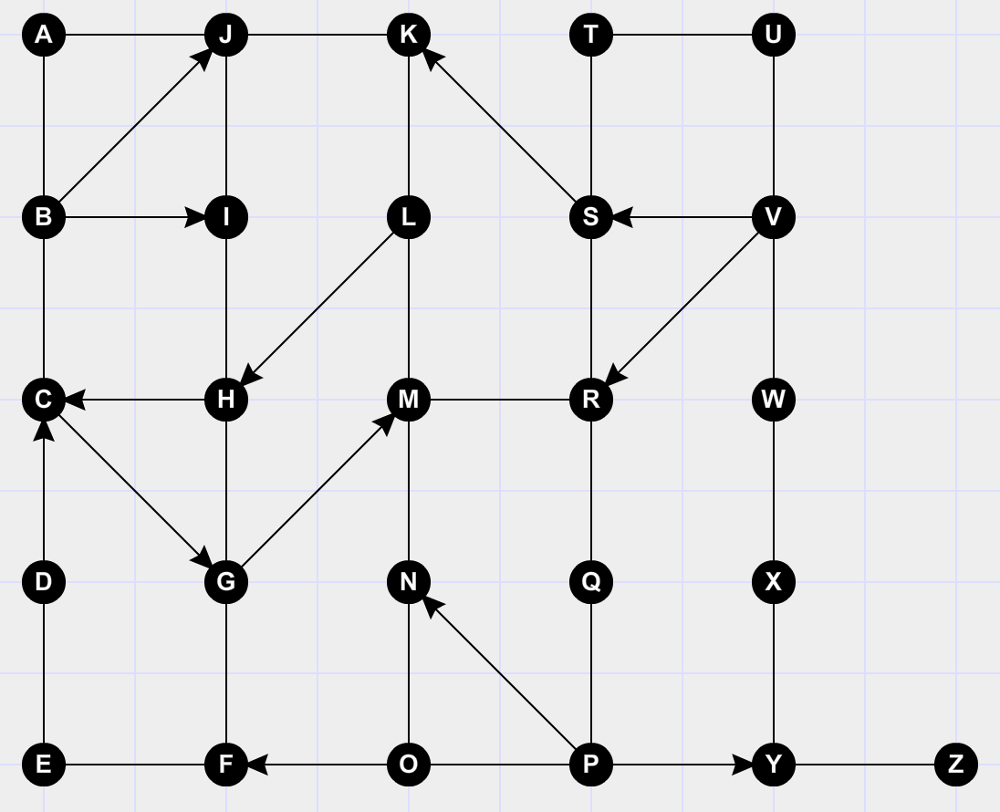
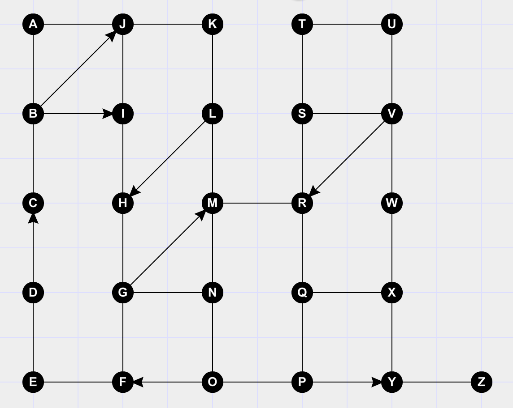

## Graph Theory

### Node/Vertex(Points) and Edges(Lines)

### Directed vs Undirected

### Weighted vs Unweighted

### Ordered pairs/Set Notation

- V = {1,2,3,4,5,6}
- E = {{1,2},{1,5},{2,3},{2,5},{3,4},{4,5},{4,6}}
- G = (V,E)

V is an example of Set Notation

E is an example of Set of Ordered Pairs

G represents the graph as 1 ordered pair.

### Exercise
Find the quickest path from Vertex A to Vertex Z:

Find the quickest path from Vertex A to Vertex Z:

Find the longest path from Vertex A to Vertex Z:

Find the quickest path from Vertex A to Vertex Z:

Find the longest path from Vertex A to Vertex Z:

